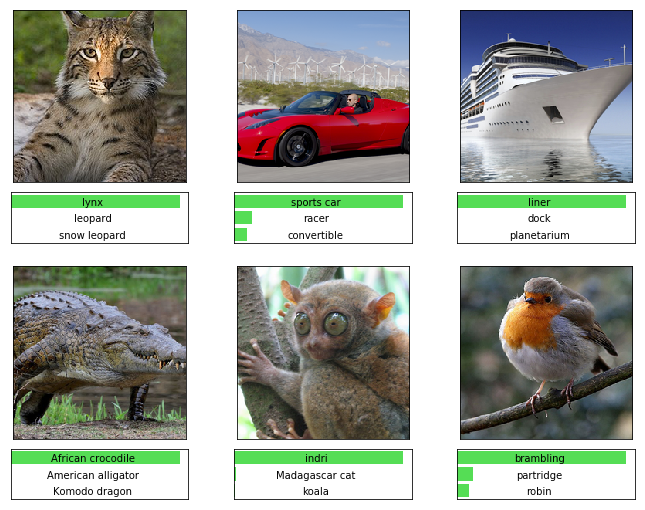

### Authors: Mathew Salvaris and Fidan Boylu Uz

# Deploy Deep Learning CNN on Kubernetes Cluster with GPUs
In this repository there are a number of tutorials in Jupyter notebooks that have step-by-step instructions on how to deploy a pretrained deep learning model on a GPU enabled Kubernetes cluster. The tutorials cover how to deploy models from the following deep learning frameworks:
* [TensorFlow](Tensorflow)
* [Keras (TensorFlow backend)](Keras_Tensorflow)
* Pytorch (Coming soon)

 
 For each framework we go through 7 steps:
 * Model development where we load the pretrained model and test it by using it to score images
 * Developing the interface our Flask app will use to load and call the model
 * Building the Docker Image with our Flask REST API and model
 * Testing our Docker image before deployment
 * Creating our Kubernetes cluster and deploying our application to it
 * Testing the deployed model
 * Testing the throughput of our model
 
The application we will develop is a simple image classification service, where we will submit an image and get back what class the image belongs to. 

If you already have a Docker image that you would like to deploy or you simply want to use the image we built you can skip the first four notebooks.

# Contributing

This project welcomes contributions and suggestions.  Most contributions require you to agree to a Contributor License Agreement (CLA) declaring that you have the right to, and actually do, grant us the rights to use your contribution. For details, visit https://cla.microsoft.com.

When you submit a pull request, a CLA-bot will automatically determine whether you need to provide a CLA and decorate the PR appropriately (e.g., label, comment). Simply follow the instructions provided by the bot. You will only need to do this once across all repos using our CLA.

This project has adopted the [Microsoft Open Source Code of Conduct](https://opensource.microsoft.com/codeofconduct/).
For more information see the [Code of Conduct FAQ](https://opensource.microsoft.com/codeofconduct/faq/) or
contact [opencode@microsoft.com](mailto:opencode@microsoft.com) with any additional questions or comments.

